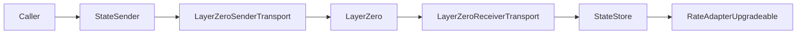

# Design

## Overview

This system relays a piece of source-chain state to a destination chain and exposes the latest accepted value to downstream readers.

Current production transport:
- LayerZero

Core properties:
- sender-side relay is permissionless
- transport is abstracted behind `IRelayTransport`
- destination writes are monotonic by `srcTimestamp`
- accepted updates are stored as append-only per-key history
- readers consume the latest accepted entry and apply freshness checks

## Components

### `StateSender`
- lives on the source chain
- `staticcall`s a configured `target` with configured `callData`
- derives a deterministic key from `(chainId, target, callData)`
- encodes `(version, key, value, srcTimestamp)`
- asks the transport for a fee quote
- sends the payload to an application `destinationId`

### `LayerZeroSenderTransport`
- transport adapter for the sender side
- maps `destinationId -> { lzEid, peer, options, enabled }`
- quotes and sends LayerZero messages
- only addresses with `SENDER_ROLE` can call `send`

### `LayerZeroReceiverTransport`
- transport adapter for the destination side
- receives the LayerZero payload
- forwards the raw message into `StateStore.write(...)`
- emits whether the message was applied or ignored

### `StateStore`
- destination-chain persistence layer
- decodes relay payloads
- validates supported versions
- accepts only strictly newer `srcTimestamp`
- appends accepted entries to `mapping(bytes32 => Entry[])`
- `get(key)` returns the latest entry
- `get(key, reverseIndex)` reads history from the end, where `0` is latest

### `RateAdapterUpgradeable`
- destination-side consumer
- reads from `StateStore`
- enforces source and destination freshness windows
- decodes the stored value into an application-specific rate

## Message Flow

```text
Source Chain
------------

  caller
    |
    v
  StateSender
    | 1. staticcall(target, callData)
    | 2. derive key
    | 3. encode(version, key, value, srcTimestamp)
    v
  IRelayTransport
    |
    v
  LayerZeroSenderTransport
    |
    | 4. send cross-chain message
    v
  LayerZero


Destination Chain
-----------------

  LayerZero
    |
    v
  LayerZeroReceiverTransport
    |
    | 5. forward raw payload
    v
  StateStore
    |
    | 6. decode + validate + append if newer
    v
  Entry history per key
    |
    v
  RateAdapterUpgradeable / other readers
```

## Mermaid



## Key Invariants

- relay key is deterministic for a source read definition
- only supported message versions are accepted
- stale or duplicate source timestamps are ignored, not reverted
- accepted entries are append-only
- readers must enforce freshness; storage alone does not imply usability

## Roles

### `StateSender`
- `DEFAULT_ADMIN_ROLE`
- `CONFIG_MANAGER_ROLE`
- `TRANSPORT_MANAGER_ROLE`
- `PAUSER_ROLE`

### `LayerZeroSenderTransport`
- `DEFAULT_ADMIN_ROLE`
- `CONFIG_MANAGER_ROLE`
- `SENDER_ROLE`

### `LayerZeroReceiverTransport`
- `DEFAULT_ADMIN_ROLE`
- `PAUSER_ROLE`

### `StateStore`
- `DEFAULT_ADMIN_ROLE`
- `VERSION_MANAGER_ROLE`
- `WRITER_MANAGER_ROLE`
- `WRITER_ROLE`
- `PAUSER_ROLE`

## Non-Goals in This Release

- production CCIP integration
- multi-transport receiver abstraction in `src/`
- onchain pruning of relay history

CCIP validation exists only in `test/` to confirm the abstraction can support another transport.
